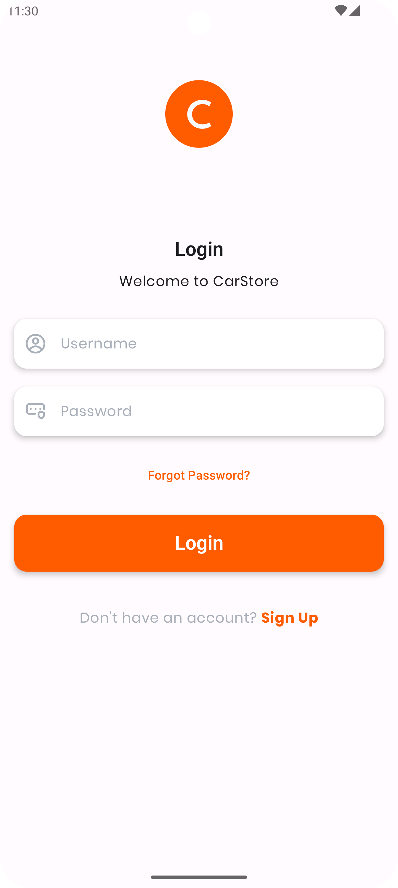

# Car Store App

A project app created to learn and demonstrate various Android development techniques using Jetpack Compose, including type-safe navigation, Hilt for dependency injection, and custom UI components such as custom cards with ribbons and bottom navigation. This project is designed for educational purposes, both for myself and for others who might find it helpful.

## Screenshots

    
    
    

## Features

- **Jetpack Compose**: Modern toolkit for building native Android UI.
- **Type-Safe Navigation**: Simplified and safer navigation using Jetpack Compose Navigation.
- **Hilt**: Dependency injection to manage app-level dependencies.
- **Custom UI Components**: Custom card with a ribbon for a unique design.
- **Bottom Navigation**: Smooth navigation between different sections of the app.

## Design

The design of this app is credited to [Mayuri Salunke](https://www.behance.net/mayurisalunke125). All visual aspects and UI elements were inspired by her beautiful designs.

## Programming

The app is programmed by [Hazrat Ummar Shaikh](https://github.com/ihazratummar/). This project serves as a learning tool and a showcase of my skills in Android development with Jetpack Compose.
